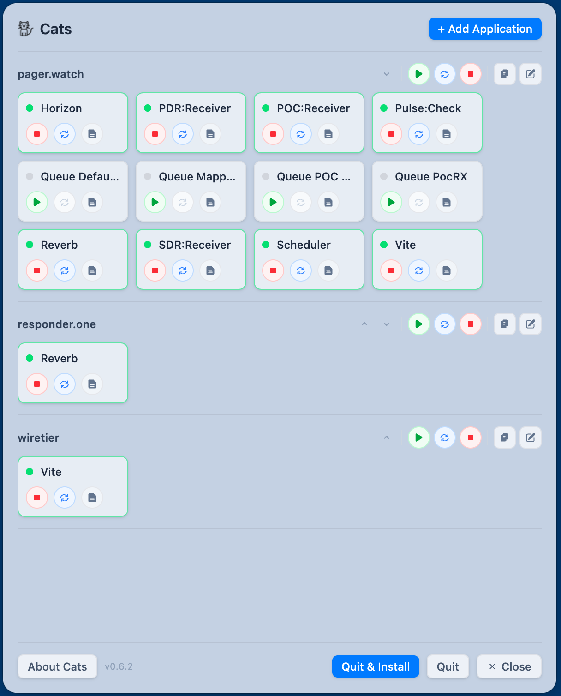
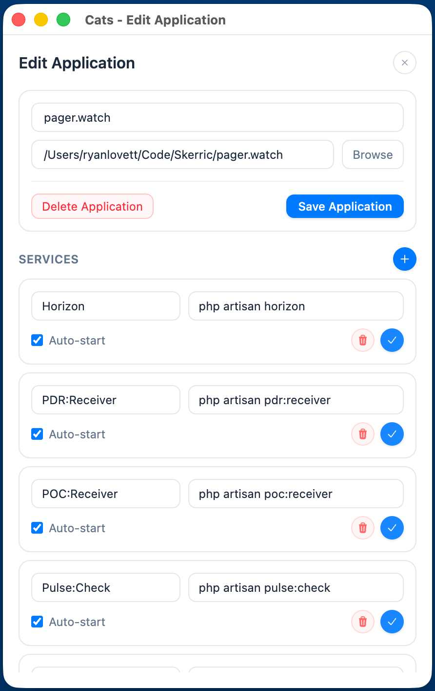
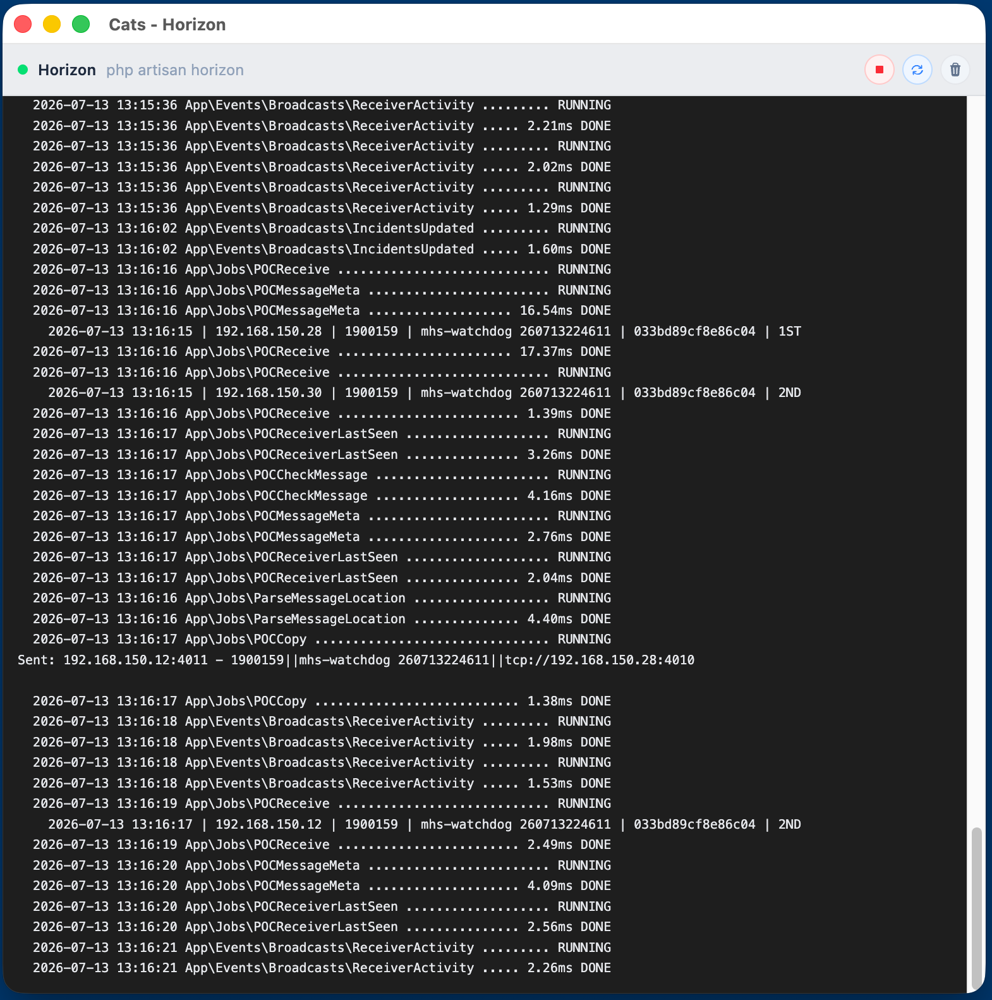

# Cats

*As in "Herding Cats" -- built to be used with [Laravel Herd](https://herd.laravel.com)*

A native macOS menu bar app for managing the background services across your development projects. Think supervisord for your Mac. Stop juggling terminal windows -- start, stop, and monitor all your dev services from one place.

Built with [Laravel](https://laravel.com), [Livewire](https://livewire.laravel.com), and [NativePHP](https://nativephp.com).

## Screenshots

**Menu bar** -- start, stop, and monitor every service, grouped by application.



**Edit application** -- name a project, pick its folder, and define its services.



**Live logs** -- tail each service's output in real time with ANSI colour.



## Features

- **Menu bar app** -- lives in your macOS menu bar, always one click away. The popover is always-on-top, resizable, and remembers its size between launches.
- **Multi-project support** -- organise services into applications, where each application is a project name plus a folder on disk.
- **Per-service control** -- start, stop, and restart each service from its own tile, with a live status dot that updates automatically.
- **Bulk controls per application** -- start all, stop all, or restart all of an application's services at once, or open every service's log in one click.
- **Auto-start** -- flag any service to launch automatically when Cats opens.
- **Live log viewer** -- a dedicated window per service that tails output in real time with ANSI colour support, plus Clear Log and a Ctrl-C shortcut to stop the service.
- **Herd-aware environment** -- services are spawned with your Homebrew, Herd, Node, and Composer paths already on `PATH`, so `php`, `node`, `npm`, and `composer` resolve the same way they do in your terminal.
- **Native folder picker** -- browse to a project path with a real macOS folder dialog when adding or editing an application.
- **Unsaved-changes protection** -- the Edit Application window warns before discarding edits and only writes changes when you save.
- **Reorder applications** -- move applications up and down to arrange them in whatever order suits you.
- **Automatic updates** -- Cats checks GitHub Releases for new versions and offers a one-click "Quit & Install Update" when a download is ready.
- **Light and dark mode** -- the interface follows a full dark theme, and the menu bar icon adapts to light or dark menu bars.
- **Clean quit** -- quitting stops every running service first, so nothing is left orphaned.

## Install

Download the latest release from the [Releases page](https://github.com/ryanlovett-au/cats/releases/latest):

- **Apple Silicon (M1 and later):** `Cats-<version>-arm64.dmg`
- **Intel:** `Cats-<version>-x64.dmg`

Open the `.dmg` and drag Cats into your Applications folder. Once installed, Cats keeps itself up to date: when a newer release is published it downloads in the background and shows a **Quit & Install Update** button in the menu.

macOS builds are notarized. If Gatekeeper still blocks the first launch, right-click the app and choose Open.

## Requirements (for building from source)

- PHP 8.2+
- Composer
- Node.js & npm
- macOS 12 (Monterey) or later -- NativePHP v2 ships on Electron, which drops support for macOS Catalina (10.15) and Big Sur (11)

## Getting Started

Clone the repo and install dependencies:

```bash
git clone https://github.com/ryanlovett-au/cats.git
cd cats
composer install
npm install
```

Set up your environment and database:

```bash
cp .env.example .env
php artisan key:generate
touch database/database.sqlite
php artisan migrate
```

## Running in Development

### Native desktop mode (recommended)

This launches the app as a native macOS menu bar application:

```bash
composer native:dev
```

This runs two processes concurrently:
- `php artisan native:run` -- the NativePHP/Electron desktop app
- `npm run dev` -- Vite dev server for hot-reloading assets

### Web mode

For development without the native wrapper:

```bash
composer dev
```

This starts the Laravel dev server, queue worker, log viewer (Pail), and Vite dev server concurrently. The app will be available at `http://localhost:8000`.

## Running Tests

```bash
composer test
```

This clears the config cache and runs the PHPUnit test suite.

## Building for Production

### 1. Build frontend assets

```bash
npm run build
```

This creates optimised production assets in `public/build/`.

### 2. Build the native binary

NativePHP uses Electron under the hood. To package the app as a distributable binary:

```bash
php artisan native:build
```

This produces a platform-specific binary (`.app` on macOS) in the `nativephp/` build directory.

For build configuration, code signing, and distribution options, see the [NativePHP build documentation](https://nativephp.com/docs/desktop/2/getting-started/build).

## Releases

Releases are published to [GitHub Releases](https://github.com/ryanlovett-au/cats/releases) and are what the in-app auto-updater consumes.

Each release is tagged `v<version>` (matching `NATIVEPHP_APP_VERSION`) and carries both architectures:

- `Cats-<version>-arm64.dmg` / `.zip` -- Apple Silicon
- `Cats-<version>-x64.dmg` / `.zip` -- Intel
- `latest-mac.yml` -- update manifest read by the auto-updater

The `prebuild` step runs `scripts/ensure-draft-release.sh`, which uses the GitHub CLI (`gh`) to ensure a matching draft release exists before `native:build` uploads its artifacts. Publishing the draft is what makes an update available to installed copies.

## Project Structure

```
app/
  Cats/
    ServiceManager.php            # Service lifecycle + Herd-aware PATH
  Models/
    Application.php               # Project model (has many services)
    Service.php                   # Service/command model
  Listeners/
    UpdateDownloadedListener.php  # Surfaces the install-update button
  Providers/
    NativeAppServiceProvider.php  # Menu bar + window config, auto-update

resources/views/livewire/
  menu.blade.php                  # Main menu bar UI (Volt)
  application.blade.php           # Add/edit application form (Volt)
  log-viewer.blade.php            # Real-time log viewer (Volt)

database/migrations/              # Database schema
routes/web.php                    # Route definitions
scripts/ensure-draft-release.sh   # Draft-release helper for builds
```

## Tech Stack

| Layer | Technology |
|-------|-----------|
| Framework | Laravel 12 |
| Desktop | NativePHP v2 (Electron) |
| UI Components | Livewire 3 + Volt |
| Styling | Tailwind CSS 4 |
| Build Tool | Vite |
| Database | SQLite |
| Log Rendering | ansi_up |

## License

MIT
